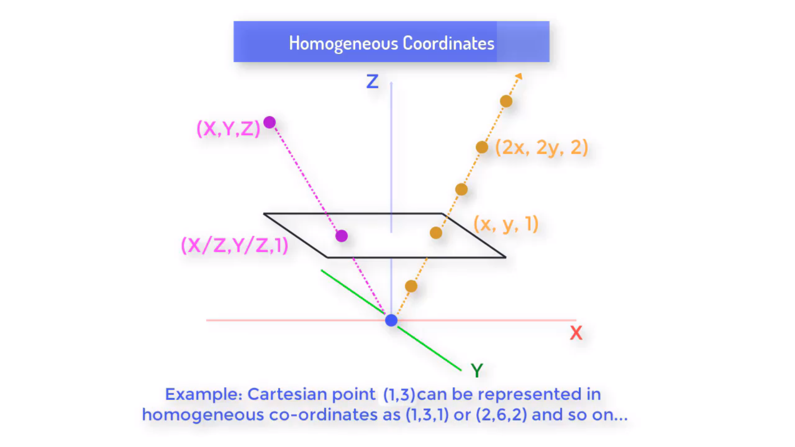
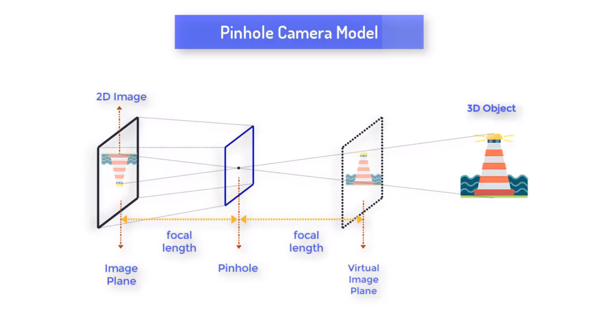
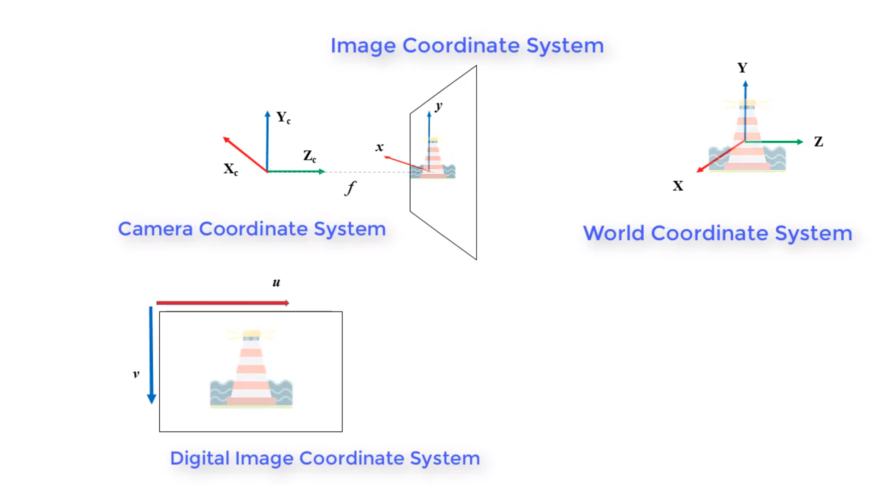
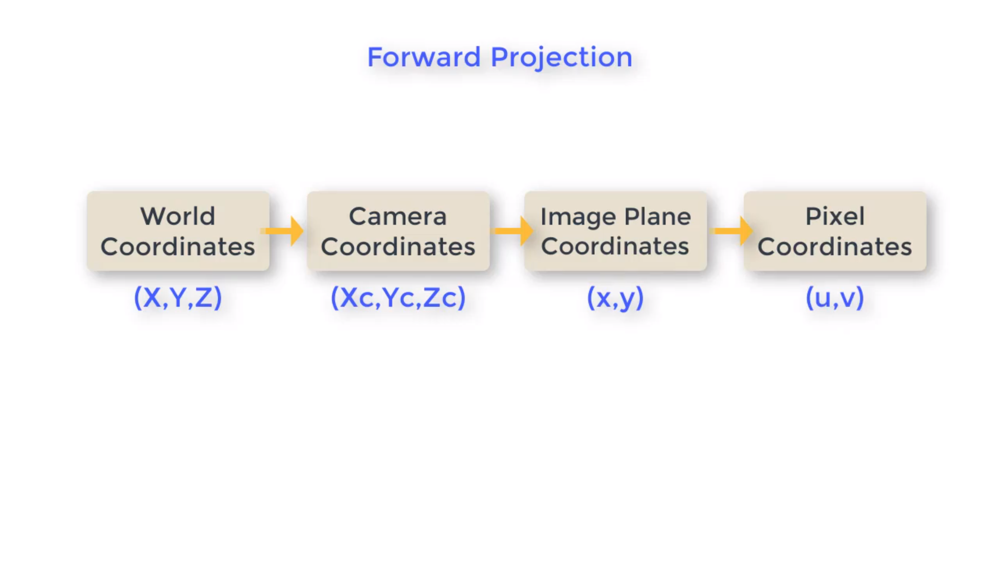
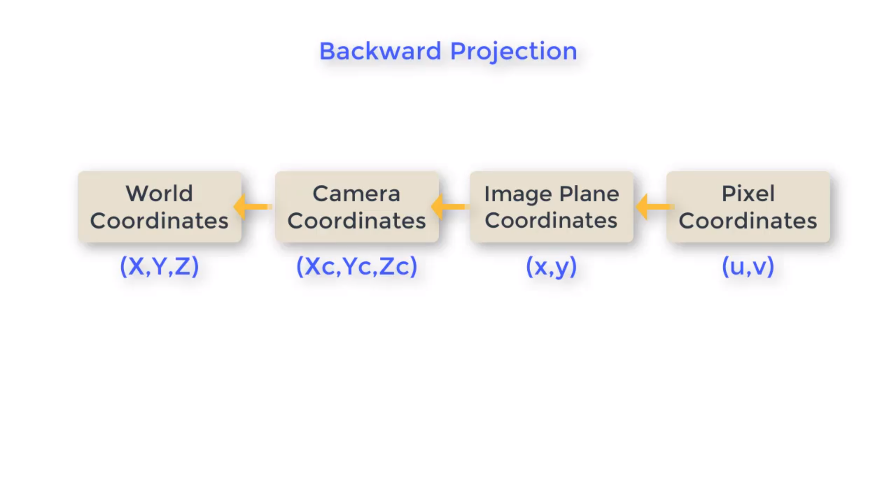
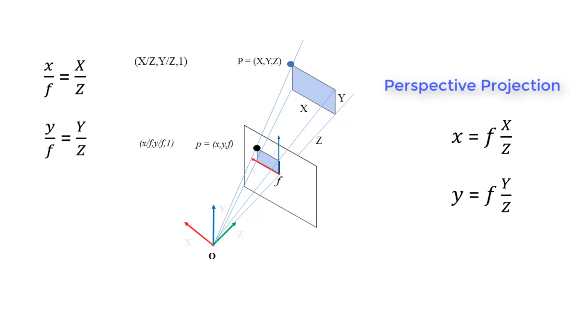
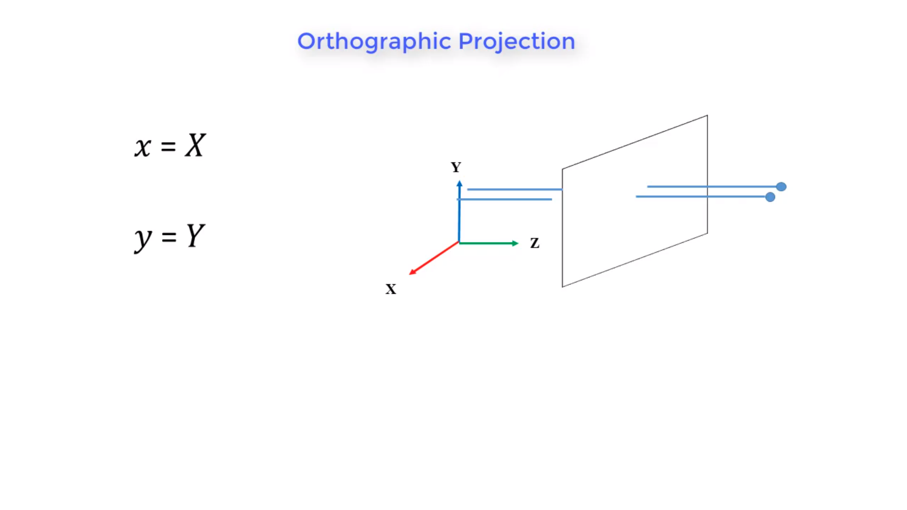

# Homogeneous Coordinates

Image plane at a distance Z, and a ray intersecting the image plane, every points on the ray maps to a single point on the image plane.
Cartesian point (1, 3) can be represented as (1, 3, 1) or (2, 6, 2), etc. in homogeneous coordinates.



# Pinhole Camera Model

In a pinhole camera, there is a pinhole plane and an image plane, the focal length is defined as the distance between the pinhole plane and the image plane.



## Image Coordinate System

```(Xc, Yc, Zc)``` represents the camera coordinate system where Z is the optic axis



Forward projection is transforming a world coordinates into pixel coordinates.



Backward projection is transforming a pixel coordinates into world coordinates.



## Perspective Projection Equations

In the example below, the world coordinates and camera coordinates are the same.
Given a point represented in the world coordinates ```(X, Y, Z)```.
The projected image coordinates is ```(x, y, f)```, where f is the focal length of the camera.

In this set up we can prove that ``` x/f = X/Z ``` and ``` y/f = Y/Z ```. And thus we have the perspective projection equations:
- ``` x = f*(X/Z) ```
- ``` y = f*(Y/Z) ```



### Orthographic Projection
Happens when ``` f = Z ```, which means that the object is placed right at the focal length. Rarely assumed in computervision since it is unrealistic, in order for this to happen, we need an image plane that is the same size as the object.


